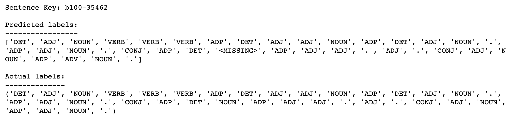
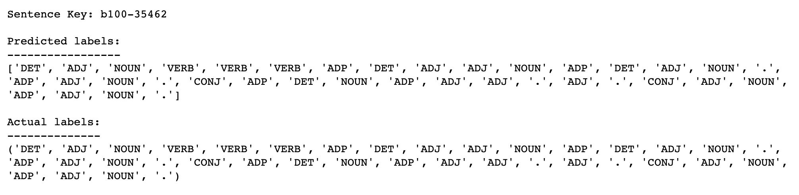

# Part of Speech Tagging with Hidden Markov Models

Part of speech tagging is the process of determining the syntactic category of a word from the words in its surrounding context. It is often used to help disambiguate natural language phrases because it can be done quickly with high accuracy. Tagging can be used for many NLP tasks like determining correct pronunciation during speech synthesis (for example, dis-count as a noun vs dis-count as a verb), for information retrieval, and for word sense disambiguation.

In this project, we'll use the Pomegranate library to build a Hidden Markov Model for part of speech tagging with a universal tagset. Hidden Markov Models have been able to achieve >96% tag accuracy with larger tagsets on realistic text corpora. Hidden Markov Models have also been used for speech recognition and speech generation, machine translation, gene recognition for bioinformatics, and human gesture recognition for computer vision, and more.

## Packages

This project primarily uses the pomegranate package to create the Hidden Markov Model.

## Credit

This was part of Udacity's Natural Language Processing Nanodegree.

## Files

The main file is **HMM_Tagger.ipynb**, which first creates a most frequent class tagger and then builds an HMM tagger. The HMM tagger has one hidden state for each possible tag, and is parameterized by two distributions: the emission probabilities giving the conditional probability of observing a given word from each hidden state, and the transition probabilities giving the conditional probability of moving between tags during the sequence.

We will also estimate the starting probability distribution (the probability of each tag being the first tag in a sequence), and the terminal probability distribution (the probability of each tag being the last tag in a sequence).

## Results

The most frequent class tagger achieved 93% accuracy on the test set.

The HMM model improved on this, reaching 96% test accuracy.

